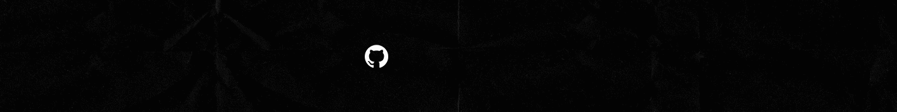

<div>
<h1 align = "center"> 

</h1>
</div>
<!-- **TobiasMoreno/TobiasMoreno** is a ✨ _special_ ✨ repository because its `README.md` (this file) appears on your GitHub profile. -->

<!-- 01A3AB -->

[](https://git.io/typing-svg)

<div> 
  <p align="center">
    <a href="https://skillicons.dev">
      
    </a>
  </p>
</div>

```js
const profileData = {
aboutMe: [
'🔭 I’m currently working on Personal Projects'
'📫 How to reach me:'
- 'tobiasmoreno.tm.21@gmail.com'
- 'LinkedIn: https://www.linkedin.com/in/tobiasmoreno/'
'👨‍💻 I am a Full-stack Web Developer,'
'🚀 I thrive on collaborating, organizing, and working with peers.,'
'🖥 I enjoy designing web applications.,'
'🙇🏻‍♂️ Currently learning Java, TypeScript and Angular,'
]
};
```



